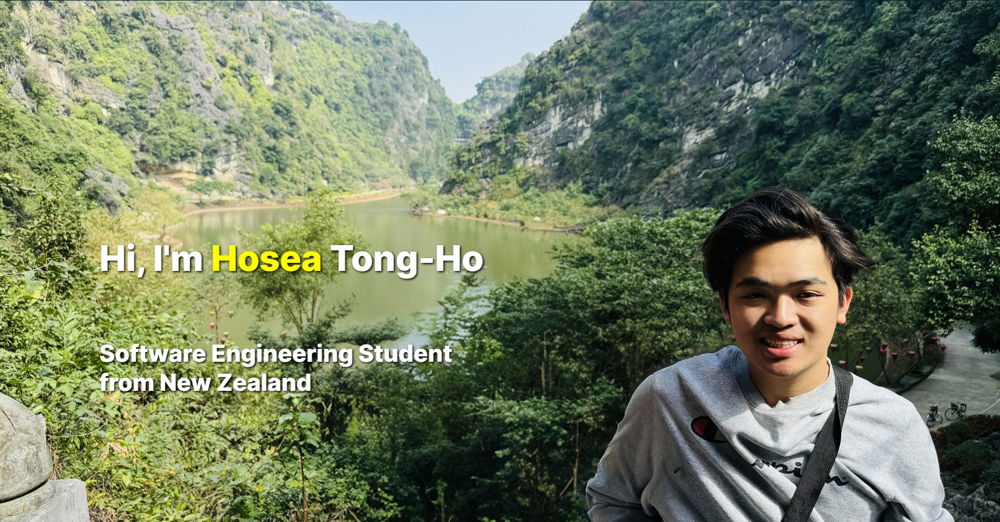

# Personal Website

Welcome to my personal website, [hoseatongho.com](http://hoseatongho.com)! This site is a showcase of my journey as a software engineer, my projects, achievements, and the activities that inspire me.

I've made this website to not only serve as a professional portfolio but also as a space where I can share my passion for technology.

## Features

- **Projects**: A detailed look at the work I've done, ranging from academic assignments to personal endeavors.
- **Résumé**: An up-to-date CV highlighting my academic and professional milestones.
- **Transcript**: Academic records that reflect my dedication and performance in my coursework.
- **Achievements**: A collection of my recognitions and awards.
- **Contact**: How to get in touch with me for potential collaborations or just to say hi!

## Socials

Connect with me on [LinkedIn](https://www.linkedin.com/in/hosea-tong-ho-47b468252/) and check out my repositories on [GitHub](https://github.com/SirBillyBobJoe).

## Contributions

Feel free to contribute to this site by submitting issues or pull requests on GitHub. Your feedback and contributions are welcome!

## Site Snippets

## Acknowledgments

- Thanks to everyone who's been a part of my journey.
- Special shout-out to my peers and mentors at the University of Auckland.

Thank you for visiting my website, and I look forward to connecting with you!

— Hosea
